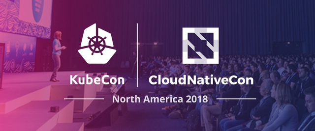
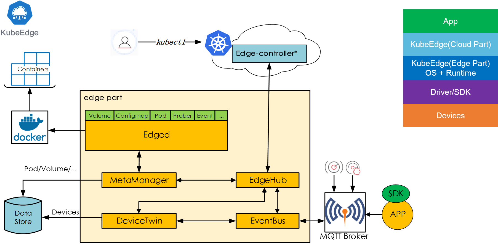

# Jamie's KubeCon 2018 trip notes #

> KubeCon + CloudNativeCon North America 2018

[Link to the event site](http://events.linuxfoundation.org/events/kubecon-cloudnativecon-north-america-2018/)

## Notable annoucements ##

- **Kubernetes 1.13 released**

*Kuberentes 1.13 was actually announced earlier this month, prior to KubeCon Seattle. This release continues to focus on stability and extensibility of Kubernetes with three major features that have graduated to general availability in the areas of  Storage and Cluster Lifecycle. Notable features include: simplified cluster management with kubeadm, Container Storage Interface (CSI), and CoreDNS as the default DNS*.

- **On Tuesday 11th December, VMware completed the acquisition of Heptio**.

*VMware paid $550 million for its recently closed acquisition of 2-year-old Kubernetes-focused startup Heptio. Heptio launched under the guise of making Kubernetes more accessible to developers running apps on-premises or in the public cloud. The company’s founders – Joe Beda and Craig McLuckie – formed Heptio having both been involved at Google on its Compute Engine and the platform that eventually became the open source Kubernetes project. Both remain active in the Kubernetes community*.

- **VMware annoucend NSX Service Mesh**.

*VMware announced the new service, which will be available early next year initially as part of Cloud PKS service in early 2019, at the Kubecon + CloudNativeCon conference, being held this week in Seattle. A stand-alone version will be ready later next year. Using the open source Istio as a foundation, VMware has introduced the VMware NSX Service Mesh to provide application-level visibility, control, and security for enterprise-grade microservices, all managed through a developer-friendly application interface (API)*.

- **Cloud Native Computing Foundation (CNCF) voted to accept etcd as an incubation-level hosted project**.

*etcd is a distributed key value store that provides a reliable way to manage the coordination state of distributed systems. etcd was first announced in June 2013 by CoreOS (part of Red Hat as of 2018). Since its adoption as part of Kubernetes in 2014, etcd has become a fundamental part of the Kubernetes cluster management software design, and the etcd community has grown exponentially. etcd is now being used in production environments at multiple companies, by large cloud providers such as AWS, Google Cloud Platform, Azure, and other on-premises Kubernetes implementations*.

- **Envoy has become a CNCF graduated project, joining Kubernetes and Prometheus**.

*Envoy’s goal is to abstract the network from application developers so that they can focus on business logic. In order to provide rich and easy to use abstractions for modern cloud native applications, Envoy focuses on the L7 or application layer of the stack. In addition to support for HTTP and gRPC, Envoy also supports Redis, Thrift, MongoDB, global rate limiting, external authentication and authorization, and many other features geared towards building modern distributed applications*.

## Key Takeaways ##

- Istio is the new black. KubeCon focus shifted away from new features of Kubernetes, focussing mainly on stability, towards Service Mesh.
- Custome Resource Definitions (CRD) and Operators received a large amnount of coverage. Operators essentially allow developers to write an application to fully manage another (think databases).
- The acquisition of Heptio by VMware was well received by the community
- Building and managing your own Kubernetes cluster is **_not_** recommended
- Knative is becoming the defacto framework and standard for running serverless on top of kubernetes, garnering support from a large amount of kubernetes ecosystem memebers

## Must See ##

### Kelsey Hightowers Keynote ###

## Ecosystem projects to watch ##

- **Knative** (Knative components offer developers Kubernetes-native APIs for deploying serverless-style functions, applications, and containers to an auto-scaling runtime. Knative together with Kubernetes form a general purpose platform with the unique ability to run serveless, stateful, batch, and machine learning (ML) workloads alongside one another.)

[Knative](http://github.com/knative/docs)

- **KubeEdge** (KubeEdge is an open source system, an optimized version of kubelet on edge, extending native containerized application orchestration and device management to hosts at the Edge.)

[Kubeedge](http://kubeedge.io)

- **Kubevirt** KubeVirt is a virtual machine management add-on for Kubernetes. The aim is to provide a common ground for virtualization solutions on top of Kubernetes.

[Kubevirt](http://github.com/kubevirt/kubevirt)

## Highlights from my schedule ##

> Attendance at over 30 sessions

### Monday 10th ###

- Kubernetes and Service Mesh Workshop with VMware (all day)

- LF Networking (LF Networking, an initiative at the Linux Foundation made up of several prominent projects in the open networking stack — FD.io, ONAP, OpenDaylight, ONFV, PNDA, SNAS, and Tungsten Fabric)

### Tuesday 11th ###

- Keynote: Developing Kubernetes Services at Airbnb Scale - Melanie Cebula, Software Engineer, Airbnb

- Birds of a Feather: What Should a Container Build Manifest Look Like? - Nisha Kumar, VMware

- Front-end Application Deployment Patterns - Ross Kukulinski, Heptio

### Wednesday ###

- Deep dive: Kubernetes IoT Edge WG – Cindy Xing, Huawei; Dejan Bosanac, Red Hat; Preston Holmes, Google; Steve Wong, VMware

- Evolution of Integration and Microservices with Service Mesh and Ballerina - Christian Posta, Red Hat

### Thursday ###

- Keynote: Smooth Operator♪: Large Scale Automated Storage with Kubernetes - Celina Ward, Software Engineer & Matt Schallert, Site Reliability Engineer, Uber

- You Can't Have a Cluster [BLEEP] Without a Cluster - Kris Nova, Heptio

- The Telco Networking Journey to Cloud Native: The Good, Bad, and Ugly - Heather Kirksey, The Linux Foundation

## Memorable Interactions ##

- Joe Beda - CEO and Founder, Heptio (1 of 3 creators of Kubernetes)
- Kris Nova - Senior Staff Developer Advocate, Heptio
- Kelsey Hightower - Staff Developer Advocate, Google
- Alex Ellis - Staff Systems Engineer, Vmware OSS (founder of OpenFaaS)
- Derek Collison - Founder & CEO, Synadia Communications
- Mitchell Hashimoto - Founder & CTO, Hashicorp

## Swag ##

> Number of **shirts** collected - 7
> Number of **books** collected - 2
> Number of **stickers** collected - 28
